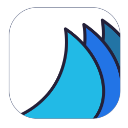

	
	<h1>🌊 DeckSurf SDK</h1>
	

		<b>Unofficial Software Development Kit for your Stream Deck.</b>
	

	 
	 
	 

For the DeckSurf tooling (_CLI and plugins_), refer to the [DeckSurf repository](https://github.com/dend/DeckSurf).

## About

The SDK is used to manage Stream Deck devices and create plugins for the [DeckSurf tools](https://github.com/dend/DeckSurf). It is completely independent of the Elgato software and/or libraries and can be used as a completely standalone library.

## Platform compatibility

The SDK in its current implementation has a number of dependencies on Windows APIs, therefore will only work on Windows. In future releases, I am thinking of a way to rip out native components and separate them in their own package, allowing the SDK to be fully cross-platform.
