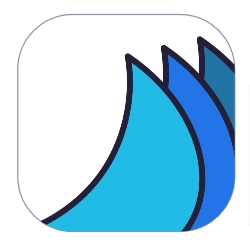

# DeckSurf SDK for .NET

_**Unofficial Software Development Kit for your Stream Deck, built in C# for the .NET platform.**_

>[!WARNING]
>This SDK is under active development and is currently in its **alpha stage**. That means that there _may be_ breaking changes between releases until it hits `1.0.0`.

>[!NOTE]
>For the DeckSurf tooling (_CLI and plugins_), refer to the [DeckSurf repository](https://github.com/dend/DeckSurf).

[](https://www.nuget.org/packages/DeckSurf.SDK)

## Installation

```bash
dotnet add package DeckSurf.SDK
```

## Quick Start

```csharp
using DeckSurf.SDK.Core;
using DeckSurf.SDK.Models;

// Enumerate connected Stream Deck devices
var devices = DeviceManager.GetDeviceList();
if (devices.Count == 0)
{
    Console.WriteLine("No Stream Deck devices found.");
    return;
}

// Use the first device
using var device = devices[0];

// Listen for button presses
device.ButtonPressed += (sender, e) =>
{
    Console.WriteLine($"Button {e.Id} {e.EventKind} (type: {e.ButtonKind})");

    // Touch screen coordinates (Stream Deck Plus only)
    if (e.TapCoordinates != null)
    {
        Console.WriteLine($"  Touch at ({e.TapCoordinates.Value.X}, {e.TapCoordinates.Value.Y})");
    }

    // Knob rotation (Stream Deck Plus only)
    if (e.IsKnobRotating == true)
    {
        Console.WriteLine($"  Knob rotating: {e.KnobRotationDirection}");
    }
};

device.StartListening();

// Set a button image (JPEG, PNG, BMP, GIF, or any ImageSharp-supported format)
byte[] image = File.ReadAllBytes("icon.png");
device.SetKey(0, image);

// Set brightness (0-100)
device.SetBrightness(80);
```

## Error Handling

The SDK uses a structured exception model rooted in `DeckSurfException`:

| Exception | When | Key Property |
|:---|:---|:---|
| `DeviceCommunicationException` | USB I/O failure during operation | `IsTransient` — true if safe to retry |
| `DeviceDisconnectedException` | Device unplugged mid-operation | `DeviceSerial` — identifies which device |
| `DeviceNotFoundException` | Device lookup failed (serial/path not found) | — |
| `ImageProcessingException` | Unrecognized image format in `SetKey` or `ImageHelper.ResizeImage` | — |
| `ObjectDisposedException` | Method called on a disposed device | — |
| `InvalidOperationException` | `StartListening()` called when already listening | — |
| `ArgumentOutOfRangeException` | Button index out of range in `SetKey` | — |
| `IndexOutOfRangeException` | Key index out of range in `SetKeyColor` | — |

```csharp
using DeckSurf.SDK.Exceptions;

try
{
    device.SetKey(0, imageData);
}
catch (DeviceCommunicationException ex) when (ex.IsTransient)
{
    // USB I/O failure — safe to retry
}
catch (DeviceDisconnectedException ex)
{
    // Device was physically unplugged
    Console.WriteLine($"Lost device {ex.DeviceSerial}");
}
```

For event-driven error handling, subscribe to `DeviceErrorOccurred`:

```csharp
device.DeviceErrorOccurred += (sender, e) =>
{
    Console.WriteLine($"Error in {e.OperationName}: {e.Category} (transient: {e.IsTransient})");
};
```

## Device Disconnection

When a device is unplugged, the `DeviceDisconnected` event fires. After this event, the device instance is unusable — no further events will fire and all method calls will throw `ObjectDisposedException`. Dispose it and acquire a fresh instance to reconnect:

```csharp
device.DeviceDisconnected += (sender, e) =>
{
    Console.WriteLine("Device disconnected. Attempting to reconnect...");
    device.Dispose();

    // Re-enumerate to find the device again
    if (DeviceManager.TryGetDeviceBySerial(knownSerial, out var newDevice))
    {
        // Use newDevice
    }
};
```

## Multiple Devices

Use serial numbers for stable device identification across re-plugs:

```csharp
// Find a specific device
if (DeviceManager.TryGetDeviceBySerial("CL12K1A00042", out var myDevice))
{
    using (myDevice)
    {
        myDevice.StartListening();
        myDevice.SetKey(0, imageData);
    }
}

// Or throw if not found
var device = DeviceManager.GetDeviceBySerial("CL12K1A00042");

// Monitor for device connection changes
DeviceManager.DeviceListChanged += (sender, e) =>
{
    Console.WriteLine("USB device change detected — re-enumerate devices.");
};
```

## Screen Support (Plus & Neo)

Devices with LCD screens expose screen operations:

```csharp
if (device.IsScreenSupported)
{
    byte[] screenImage = File.ReadAllBytes("banner.jpg");
    var resized = ImageHelper.ResizeImage(
        screenImage,
        device.ScreenWidth,
        device.ScreenHeight,
        device.ImageRotation,
        device.KeyImageFormat);
    device.SetScreen(resized, 0, device.ScreenWidth, device.ScreenHeight);
}
```

## Thread Safety

The SDK is **not thread-safe**. If you call `SetKey()`, `SetBrightness()`, or `SetKeyColor()` from multiple threads, you must synchronize access:

```csharp
var deviceLock = new object();

lock (deviceLock)
{
    device.SetKey(0, imageData);
}
```

## Supported Devices

| Device | Support |
|:----------------------------|:--------|
| Stream Deck XL              | Full |
| Stream Deck XL (2022)       | Full |
| Stream Deck Plus            | Full |
| Stream Deck Original        | Full |
| Stream Deck Original (2019) | Full |
| Stream Deck MK.2            | Full |
| Stream Deck Mini            | Full |
| Stream Deck Mini (2022)     | Full |
| Stream Deck Neo             | Full |

## Platform Support

Core functionality is **cross-platform** (Windows, macOS, Linux). The SDK uses [HidSharp](https://github.com/IntergatedCircuits/HidSharp) for USB HID communication, which supports all three platforms.

A small number of utility methods (`ImageHelper.GetFileIcon()`, `ImageHelper.GetImageBuffer(Icon)`) are **Windows-only** and are marked with `[SupportedOSPlatform("windows")]`. These are optional helper methods — all core device operations work cross-platform.

**Linux note:** You may need to configure udev rules for USB device access without root. See the [HidSharp documentation](https://github.com/IntergatedCircuits/HidSharp) for details.

## Documentation

Refer to [`https://docs.deck.surf`](https://docs.deck.surf/) for tutorials and full API documentation.

## License

This project is licensed under the MIT License. See [LICENSE.md](LICENSE.md) for details.
